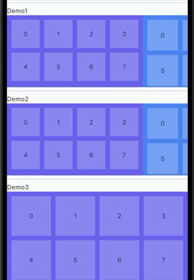

# 可变宽度滚动物理效果

一个Flutter包，提供自定义滚动物理效果和部件，用于处理具有动态高度调整的可变宽度页面。非常适合创建灵活的页面视图，其中每个页面可以具有不同的宽度和高度。



## 功能特性

- **可变宽度页面滚动物理效果**：自定义滚动物理效果，可捕捉不同宽度的页面
- **自适应高度页面滑动器**：根据滚动位置自动调整容器高度
- **基于Sliver的滑动器**：使用Flutter的sliver系统高效实现，适用于按需加载的页面

### 核心组件

1. **FlexPageScrollPhysics**：处理可变宽度页面的自定义ScrollPhysics
2. **FlexPageSlider**：根据滚动位置动态调整高度的部件
3. **FlexSliverSlider**：基于Sliver的实现，为多个项目提供更好的性能

## 开始使用

在您的`pubspec.yaml`文件中添加：

```yaml
dependencies:
  variable_width_scrollphysics: ^0.0.1
```

## 使用方法

### 基本可变宽度页面视图

```dart
import 'package:variable_width_scrollphysics/variable_width_scrollphysics.dart';

FlexPageSlider(
  pageWidths: [300, 400, 350],  // 每个页面的宽度
  pageHeights: [200, 300, 300], // 每个页面的高度
  child: Row(
    children: [
      // 您的页面内容放在这里
      Container(width: 300, color: Colors.red),
      Container(width: 400, color: Colors.green),
      Container(width: 350, color: Colors.blue),
    ],
  ),
)
```

### 使用自定义ScrollPhysics

```dart
SingleChildScrollView(
  scrollDirection: Axis.horizontal,
  physics: FlexPageScrollPhysics([300, 400, 400]),
  child: Row(
    children: [
      Container(width: 300, child: Page1()),
      Container(width: 400, child: Page2()),
      Container(width: 400, child: Page3()),
    ],
  ),
)
```

## 示例

查看`/example`文件夹获取完整示例：

- **Demo1**：具有不同高度的基本可变宽度页面
- **Demo2**：具有可变宽度的图片画廊
- **Demo3**：使用sliver实现的动态内容
- **Demo4**：具有嵌套滚动的复杂布局

运行示例：

```bash
cd example
flutter run
```

## 更多信息

此包适用于：
- 具有不同图片尺寸的图片画廊
- 具有可变内容的卡片布局
- 需要可变宽度页面和平滑滚动的任何UI

如需报告错误或功能请求，请在[GitHub仓库](https://github.com/your-repo/variable_width_scrollphysics)上提交问题。

## 语言

- [English](README.md)
- [中文](README_CN.md)